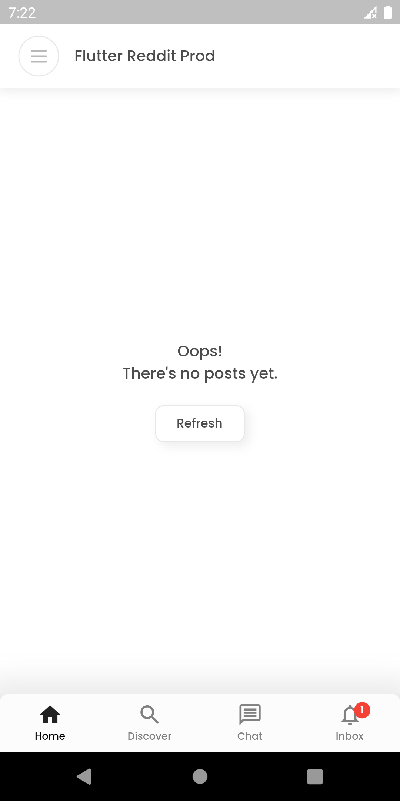
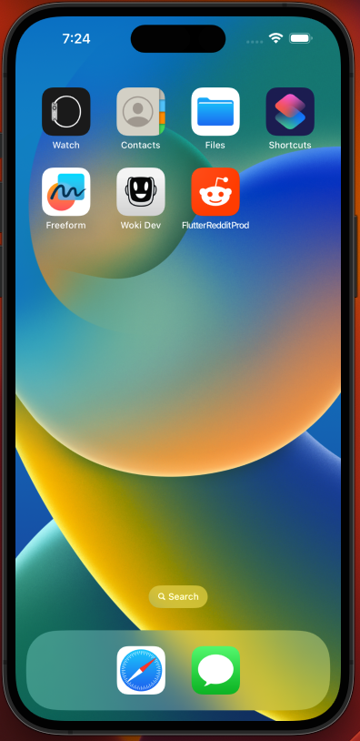

# Coding Challenge: flutter_reddit_app

## Functionalities

- Shows a list of posts from r/pics subrredit
- Shows post detail screen
- Checks internet connection before retrieve information
- Choose between 3 differents flavors: dev, staging and production

### Others
- Shows android and ios app icons (reddit logo)
- Shows splash screen when app is starting
- Shows empty screens

## Images

# How to run the app

To run the app according to a flavor:

- Dev: flutter run --flavor dev -t lib/main_dev.dart
- Staging: flutter run --flavor staging -t lib/main_staging.dart
- Production: flutter run --flavor production -t lib/main_production.dart
 
In VSCode, go to Run and Debug section, select a flavor and press Start debugging.